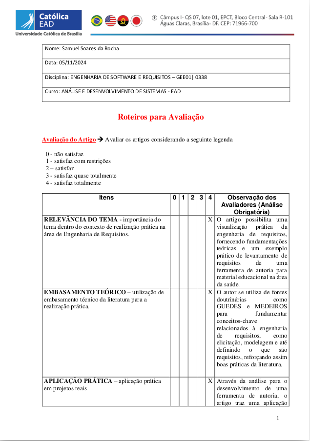
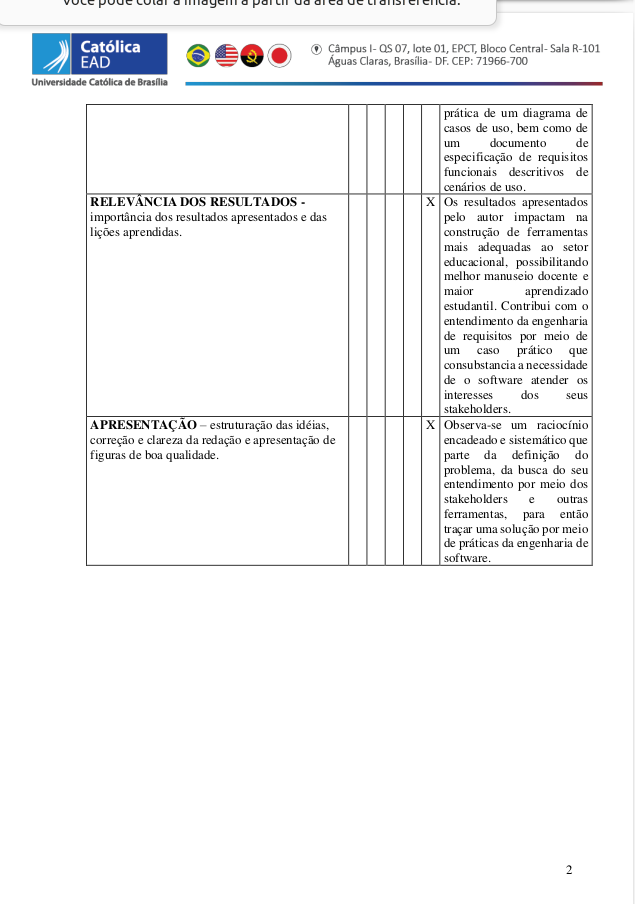
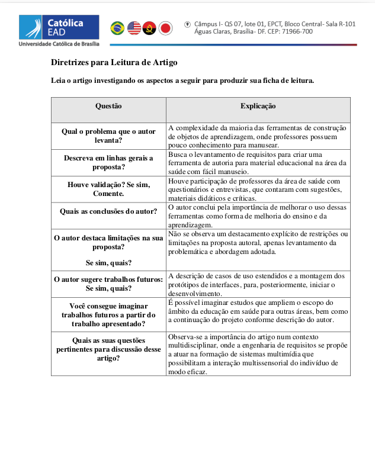
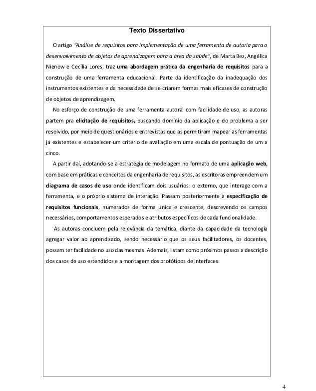

# Atividade avaliativa Unidade 3

Esta página contém uma atividade de fichamento do artigo "ANÁLISE DE REQUISITOS PARA IMPLEMENTAÇÃO DE UMA FERRAMENTA DE AUTORIA PARA O DESENVOLVIMENTO DE OBJETOS DE APRENDIZAGEM PARA A ÁREA DA SAÚDE" de Bez; Nienow e Flores, elaborada como avaliação da Unidade 3 da disciplina **Engenharia de Software e Requisitos**.

## Objetivo do Trabalho

O objetivo deste trabalho foi refletir sobre a importância da engenharia de requisitos a partir de uma abordagem prática.

## Estrutura do Conteúdo

Abaixo estão algumas fotos do conteúdo da atividade. Para acessar o conteúdo completo, [clique aqui para baixar o PDF](../../../../docs/SamuelRocha-ES2024.pdf).

### Fotos do Conteúdo

#### Início

#### Corpo

### Dissertação

> **Nota**: Este trabalho foi desenvolvido exclusivamente para fins acadêmicos na disciplina de **Engenharia de Software e Requisitos**.
