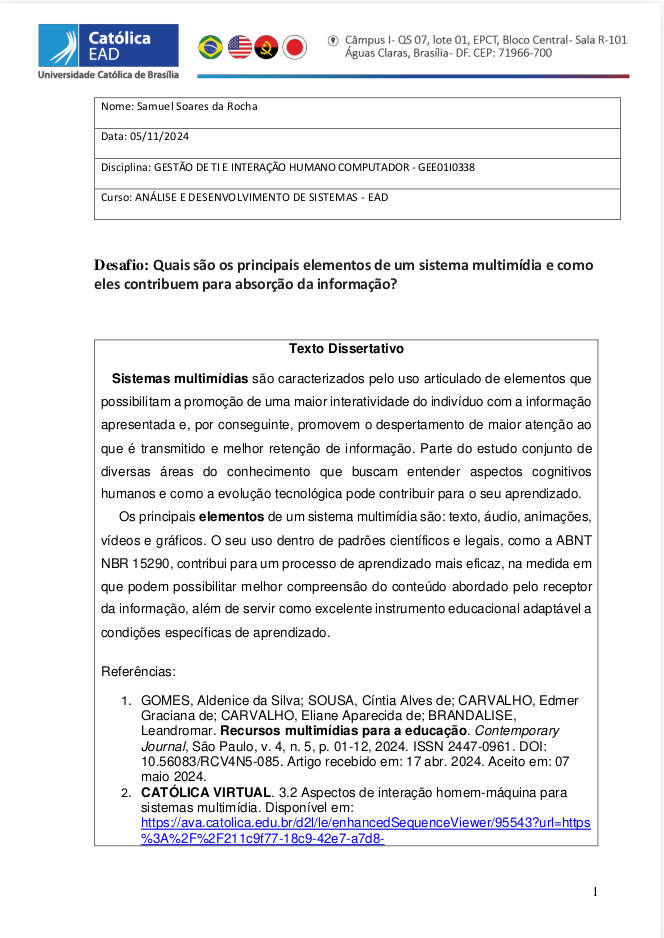

# Atividade avaliativa Unidade 3

Esta página contém uma atividade textual centrada na temática dos sistemas multimídias, elaborada como avaliação da Unidade 3 da disciplina **Gestão de TI e Interação humano-computador**.

## Objetivo do Trabalho

O objetivo deste trabalho promover reflexão sobre o conceito de sistemas multimídias, sua importância e elementos.

## Estrutura do Conteúdo

Abaixo está uma foto do conteúdo da atividade. Para acessar o conteúdo completo, [clique aqui para baixar o PDF](../../../../docs/SamuelRocha-GTI2024.pdf).

### Fotos do Conteúdo

#### CONTEÚDO

> **Nota**: Este trabalho foi desenvolvido exclusivamente para fins acadêmicos na disciplina de **Gestão de TI e Interação humano-computador**.
