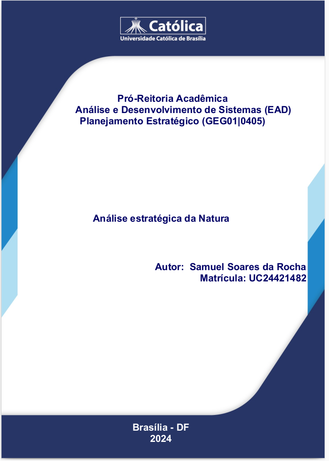
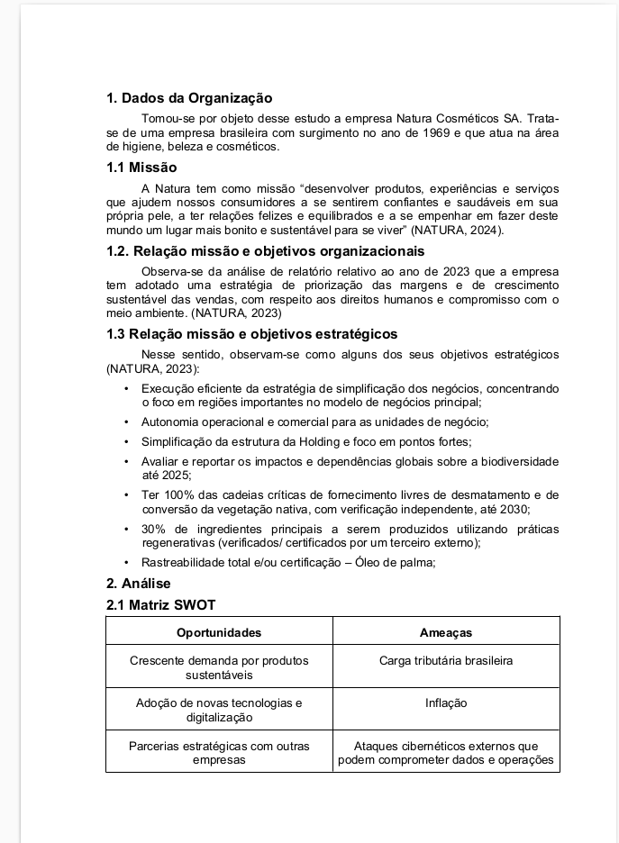
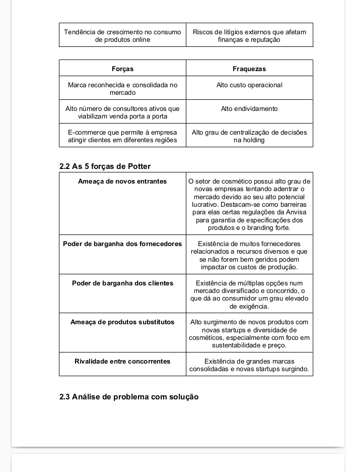
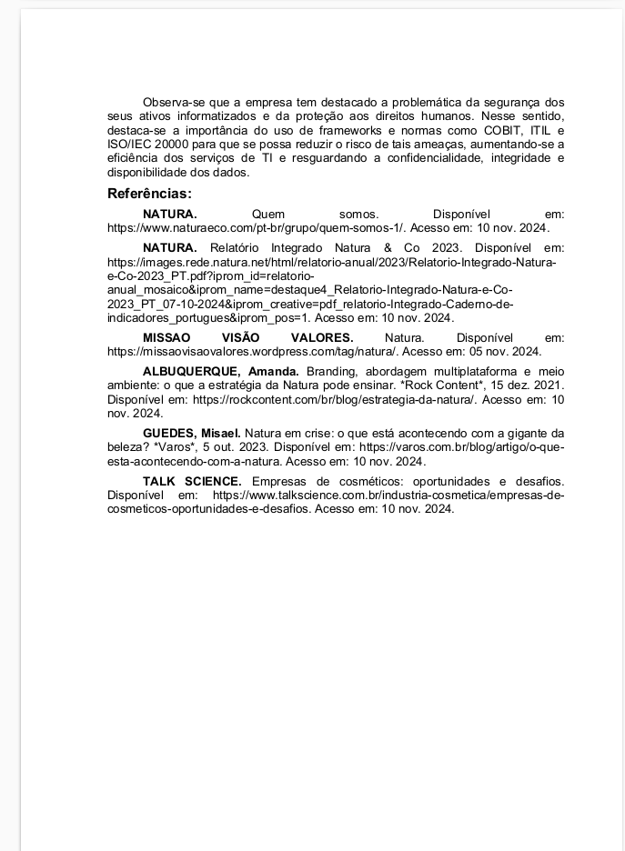

# Análise Estratégica da Natura

Esta página contém uma análise estratégica da empresa **Natura**, elaborada como avaliação da Unidade 3 da disciplina **Planejamento Estratégico**.

## Objetivo do Trabalho

O objetivo deste trabalho é aplicar conceitos de planejamento estratégico para analisar a posição e as estratégias de mercado da Natura, uma das maiores empresas de cosméticos do Brasil. A análise aborda pontos como o ambiente de mercado, as forças e fraquezas da empresa, e as oportunidades e ameaças (Análise SWOT), além de considerar a missão, visão e valores da organização.

## Estrutura do Conteúdo

Abaixo estão algumas fotos das seções do trabalho para visualização rápida. Para acessar o conteúdo completo, [clique aqui para baixar o PDF](../../../../docs/SamuelRocha-PE2024.pdf).

### Fotos do Conteúdo

#### CAPA

#### CONTEÚDO

#### Referências

> **Nota**: Este trabalho foi desenvolvido exclusivamente para fins acadêmicos na disciplina de Planejamento Estratégico.
